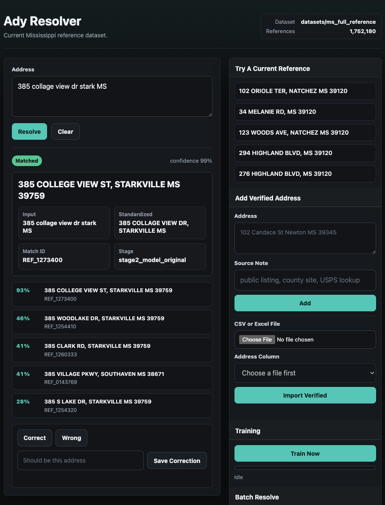

# Ady Resolver

[](https://github.com/bt1142msstate/Ady-Resolver/actions/workflows/tests.yml)
[](LICENSE)

Ady Resolver is a Python address-resolution toolkit focused on messy
Mississippi addresses. It ships with a pretrained Stage 2 model and a small
checked-in demo reference set, builds larger canonical reference sets from
public or private address sources, generates typo-heavy training/evaluation
data from real source records, and serves a local browser app for inspecting how
an input address is standardized, scored, and matched.



## Features

- Real-address-first dataset generation. The generator samples reference,
  positive, no-match, and adversarial examples from loaded real address source
  records instead of inventing synthetic addresses.
- Hard adversarial no-matches. The generator deliberately chooses near-neighbor
  real non-matches such as same house/city with a similar street or same
  street/city with a nearby house number, then corrupts those examples.
- Bring-your-own address CSV training. Generic CSVs can use either structured
  columns or a single `full_address`/`address` column with optional
  `city`/`state`/`zip` columns.
- Mississippi source ingestion from MARIS parcel situs data, public MARIS point
  addressing ZIPs, OpenAddresses processed extracts, OpenAddresses source
  services, NAD text exports, and manual verified supplements.
- Locality-aware resolver pipeline with deterministic Stage 1 rules and a
  lightweight Stage 2 model trained with mined hard negatives, phonetic
  street/city features, rank/margin features, ZIP/city consistency,
  source-quality weighting, and stronger house-number mismatch penalties.
- Typo handling for street names, street suffixes, city names, directionals,
  reordered house-number positions, scrambled address component order, and
  compounded input errors such as `101 candoowse sr newtooon MS`,
  `candace 101 se netooailn missppi`, or `new1on candace se 101 mississipi`.
- Data-quality guards for obvious parcel/location artifacts such as zero house
  numbers, non-numeric house numbers, side-of-road markers, `N OF ...`
  descriptors, `DOD` note rows, and duplicated terminal street types.
- Browser app for typing an address and seeing the standardized query,
  selected match, confidence, stage, and top candidates. The app can collect
  correct/wrong/correction feedback, apply exact-input feedback overrides, and
  queue active-learning retraining in the background.
- CSV/XLSX workflows in the browser app. Batch Resolve inspects the selected
  file, lets you choose the address and optional ID columns from dropdowns, and
  returns an Excel report. Add Verified Address can import verified rows from
  CSV/XLSX into the manual supplement without retyping each address.

## Quick Start

Ady Resolver uses the Python standard library only.

```bash
git clone https://github.com/bt1142msstate/Ady-Resolver.git
cd Ady-Resolver
python3 -m unittest discover -s tests -v
```

Common development commands are also available through `make`:

```bash
make test    # compile Python, check browser JS syntax, run unit tests
make smoke   # run the checked-in demo resolver accuracy smoke
make app     # start the local browser app on 127.0.0.1:8765
```

Run the local app after building or restoring a reference cache:

```bash
python3 src/resolver_app.py
```

Then open `http://127.0.0.1:8765`.

## Repository Contents

- `src/address_dataset_generator.py` - compatibility CLI/facade for dataset
  generation. Source loading, noise generation, and dataset assembly live in
  focused modules such as `address_source_*`, `address_openaddresses.py`,
  `address_maris.py`, `address_noise.py`, and `address_dataset_build.py`.
- `src/address_resolver.py` - compatibility CLI/facade for the resolver. Shared
  models, parsing, reference loading, and Stage 2 training/scoring live in
  `resolver_models.py`, `resolver_parsing.py`, `resolver_reference.py`, and
  `resolver_stage2.py`.
- `src/resolver_app.py` - local web app entrypoint. App config, persistence,
  service logic, HTTP routing, reference-cache building, batch file handling,
  and static UI assets are split across `resolver_app_*`,
  `resolver_reference_cache.py`, `resolver_batch_io.py`, `resolver_http.py`,
  and `src/static/`.
- `src/train_from_addresses.py` - one-command dataset generation and model
  training for custom address CSVs.
- `DATA_SOURCES.md` - concise source and coverage guidance for supported public,
  authoritative, licensed, and manual address data paths.
- `sources/` - JSON source manifests for rebuilding from local public caches or
  adapting the pipeline to your own address exports.
- `models/` - small checked-in Stage 2 model JSON artifacts.
- `examples/` - a small demo reference set and custom-address CSV example for
  fresh clones.
- `tests/` - regression tests for source parsing, resolver behavior, metrics,
  generator noise, ZIP/city enrichment, and OpenAddresses direct caching.

Generated `datasets/` and `runs/` directories are intentionally ignored by git.
They can be several GB because they contain downloaded public source archives,
normalized caches, full reference CSVs, and prediction outputs. The repository
includes the pretrained model at `models/stage2_model.json` and a tiny demo
reference set at `examples/demo_reference/reference_addresses.csv`; rebuild
larger local data with the commands below instead of committing generated
artifacts.

If `datasets/ms_full_reference/reference_addresses.csv` is missing, the local
app automatically falls back to `examples/demo_reference` so a fresh clone can
still run. That demo is intentionally small and is not the Mississippi-wide
reference cache.

## Real Mississippi Address Data

The generator now supports real address sources for Mississippi. For exhaustive
Mississippi coverage, use the MS811/MARIS county shapefile ZIP set and keep the
county-coverage guard enabled.

See [DATA_SOURCES.md](DATA_SOURCES.md) for a shorter source-quality and
coverage guide.

- MS811/MARIS full county shapefile ZIPs: production source for all 82
  Mississippi counties when obtained through the MARIS distribution agreement.
- Public MARIS Mississippi Point Addressing ZIPs: easiest public Mississippi
  source and the best public default tested here, but MARIS notes city point
  addresses may not be included and the public download page is only a subset
  of counties.
- Public MARIS statewide parcel situs addresses: broad public fallback with
  parcel `SITEADD`/`SCITY`/`SSTATE`/`SZIP` fields across all county parcel
  layers. This is not true point-address data, but it is the closest public
  statewide fallback found.
- OpenAddresses Mississippi extracts: supported as supplemental/development
  data. The current easy processed extracts are not exhaustive and many rows
  lack city/ZIP locality fields.
- OpenAddresses direct source catalog: supported as a cached normalizer for
  current OpenAddresses Mississippi source definitions. ArcGIS services are
  retried with smaller batches when large requests fail; HTTP shapefile ZIP
  sources are parsed through the DBF reader; county-only situs rows are allowed
  only when the source coverage proves Mississippi county/state context.
- Manual verified Mississippi supplement: optional local CSV for individually
  verified public addresses that are missing from the bulk public feeds.
- USDOT National Address Database (NAD): supported parser/download path, but
  Release 22 was not useful for Mississippi in testing. The national file had
  only three `State=MS` rows, all with non-Mississippi ZIPs, so it is cached for
  audit but not merged into the app reference cache.

Practical source strategy:

- Best public baseline: merge MARIS parcels, public MARIS Point Addressing,
  OpenAddresses, and the manual verified supplement.
- Best authoritative Mississippi route: obtain the local/state NG9-1-1 address
  point repository or full MS811/MARIS county point-address distribution.
- Best deliverable-mail route: use a licensed USPS/CASS/DPV-capable source or
  API. That is validation-grade for postal delivery, but it is not the same as
  a free downloadable public address list.
- Operational fallback: add verified misses to
  `datasets/source_cache/manual_verified_ms/verified_addresses.csv`. The local
  app has an Add Verified Address form that writes this supplement, updates the
  live resolver index, and persists the address into the current reference CSV.
  The resolver result panel also has Correct, Wrong, and Save Correction
  feedback controls. Feedback is written to
  `datasets/source_cache/active_learning/resolver_feedback.csv`; corrections
  also add the verified address to the manual supplement.

Audit the current public source caches before rebuilding:

```bash
python3 src/address_dataset_generator.py \
  --audit-sources \
  --source-audit-output datasets/source_cache/source_audit.json
```

The audit reports rows seen, rows loaded, skip reasons, duplicates, county
coverage, city/ZIP counts, per-source net-new records, and OpenAddresses direct
status counts. With the current local cache, the audit exposes the exact
OpenAddresses direct gaps instead of hiding them behind a single skipped-row
count.

Build from the checked-in public-source manifest:

```bash
python3 src/address_dataset_generator.py \
  --source-manifest sources/ms_public_sources.json \
  --paired-output-dir datasets/ms_public_manifest \
  --paired-shared-reference
```

The app can use the same manifest when rebuilding its reference cache:

```bash
python3 src/resolver_app.py \
  --source-manifest sources/ms_public_sources.json \
  --rebuild-reference-cache
```

Generate from locally supplied MS811/MARIS county shapefile ZIPs with all-82
county enforcement:

```bash
python3 src/address_dataset_generator.py \
  --real-address-input datasets/source_cache/ms811 \
  --real-address-format maris \
  --real-address-state MS \
  --require-ms-county-coverage \
  --paired-output-dir datasets/ms811_real \
  --paired-shared-reference
```

Generate from the public MARIS Point Addressing page:

```bash
python3 src/address_dataset_generator.py \
  --download-maris-point-addresses \
  --real-address-format maris \
  --paired-output-dir datasets/ms_public_maris \
  --paired-shared-reference \
  --reference-size 5000 \
  --noisy-per-reference 12
```

Generate from the public MARIS statewide parcel fallback:

```bash
python3 src/address_dataset_generator.py \
  --download-maris-parcels \
  --real-address-format maris_parcels \
  --require-ms-county-coverage \
  --paired-output-dir datasets/ms_public_parcels \
  --paired-shared-reference
```

`--download-maris-parcels` uses `datasets/source_cache/maris_parcels` by
default. Once the 81 parcel CSVs are cached, later runs reuse those files and do
not download them again. Use `--refresh-maris-parcel-cache` only when you want
to replace the cached parcel files from MARIS.

Generate from OpenAddresses Mississippi extracts for supplemental/dev testing:

```bash
python3 src/address_dataset_generator.py \
  --download-openaddresses-ms \
  --real-address-format openaddresses \
  --paired-output-dir datasets/ms_openaddresses \
  --paired-shared-reference
```

Generate from the current OpenAddresses Mississippi source catalog by querying
the source ESRI services directly and caching normalized CSVs:

```bash
python3 src/address_dataset_generator.py \
  --download-openaddresses-ms-direct \
  --real-address-format openaddresses \
  --paired-output-dir datasets/ms_openaddresses_direct \
  --paired-shared-reference
```

`--download-openaddresses-ms-direct` uses
`datasets/source_cache/openaddresses_ms_sources` for cached source JSON and
`datasets/source_cache/openaddresses_ms_direct` for normalized CSV output.
Later runs reuse both caches. Use `--refresh-openaddresses-ms-source-cache` or
`--refresh-openaddresses-ms-direct-cache` only when you explicitly want to
re-query upstream services.

The generator is real-address-only by default. Reference records, standard
no-match bases, and adversarial no-match bases are all sampled from the loaded
real address pool. Query strings may still contain typos, missing fields, or
other resolver noise, but those variants are derived from real source records.
If the real source pool is too small, generation fails instead of inventing
replacement addresses.

## Train On Your Own Addresses

Ady Resolver is not locked to Mississippi. The checked-in model is a Mississippi
pretrained model, but the training pipeline can build a new model from any
address source you provide. The easiest path is a CSV with one of these shapes:

```csv
full_address
"101 Candace St, Newton, MS 39345"
```

or structured columns:

```csv
house_number,street_name,street_type,city,state,zip_code
101,Candace,ST,Newton,MS,39345
```

One-command custom training:

```bash
python3 src/train_from_addresses.py \
  --address-input examples/custom_addresses.csv \
  --address-format generic \
  --state MS \
  --reference-size 4 \
  --noisy-per-reference 2 \
  --model-path models/custom_stage2_model.json \
  --work-dir datasets/custom_training \
  --run-dir runs/custom_training
```

For larger address lists, raise `--reference-size` and keep
`--noisy-per-reference` high enough to create the typo patterns you care about.
The default generator setting is now `12` noisy positives per reference; use
`16` or more when you want a slower, harder training set for confidence
calibration. Hard profiles include reordered examples where the house number
appears after the street name, heavy city/state typos, street-type typos such as
`ST -> SE`, dropped house-number digits, and scrambled component order where
city/state, house number, street name, and street type may appear in different
positions. The resulting model can be passed to the app with `--model-path`, and
the app can use any reference directory containing a `reference_addresses.csv`.

Important coverage note: no open public web download tested here proves every
current Mississippi address is present. The generator's
`--require-ms-county-coverage` check intentionally fails unless the input file
names cover all 82 Mississippi counties, so use it with the full MS811/MARIS
county ZIP directory. For mixed public/private source stacks, prefer a source
manifest. See `sources/ms_public_sources.json` for the public baseline and
`examples/custom_sources_manifest.json` for a bring-your-own template.

Source comparison from the April 27, 2026 smoke tests:

- Public MARIS Point Addressing downloads: 25 ZIPs, 25 inferred counties,
  522,958 strict usable Mississippi address records after parsing the DBFs as
  MARIS/NG9-1-1 point-address data. The parser skips placeholder localities
  such as `COUNTY`/`RURAL`, falls through to real `Post_Comm` values when
  present, and recovers common street suffixes embedded in name fields.
- OpenAddresses processed Mississippi downloads: 23 ZIPs, 166,615 strict usable
  Mississippi address records after rejecting rows with ZIPs outside the
  Mississippi postal prefix range, and 14 inferred counties.
- OpenAddresses current Mississippi source catalog direct cache: 34 CSVs,
  628,692 rows seen, 587,031 usable Mississippi address records, and 156,520
  new canonical source addresses after de-duplicating against the older
  MARIS/OpenAddresses/manual source stack. ArcGIS services are retried with
  smaller batches, one HTTP shapefile ZIP source is parsed through DBF
  attributes, and county-only situs rows are kept at lower source quality only
  when OpenAddresses coverage confirms Mississippi county/state context.
- Public MARIS parcel service: 81 parcel layers covering all 82 county names,
  with 1,970,713 non-empty `SITEADD` records before parser filtering and
  de-duplication. Use as a public fallback, not as a replacement for point
  addresses.
- The current local app cache merges MARIS parcels, public MARIS point-address
  ZIPs, archived OpenAddresses, current OpenAddresses direct ESRI CSVs, and the
  manual verified supplement. It now filters obvious parcel/location artifacts
  such as zero house numbers, non-numeric house numbers, `S/S` side-of-road
  markers, `N OF ...` descriptors, `DOD` note rows, and duplicated terminal
  street types. In the current development cache, filtering, de-duplication,
  conservative ZIP-to-city consensus variants, and manual verified additions
  produce 1,843,344 live resolver reference rows. ZIP-to-city variants require
  at least 25 real records in a ZIP and a 98% dominant postal-community share.
- Full MS811/MARIS county ZIP input is the only configured path that is allowed
  to pass the all-82-county guard as true point-address input.

Train and evaluate:

```bash
python3 src/address_resolver.py \
  --mode fit-predict \
  --train-dataset-dir datasets/ms811_real/train_dataset \
  --eval-dataset-dir datasets/ms811_real/eval_dataset \
  --model-path models/stage2_model.json \
  --output-dir runs/ms811_real \
  --jobs 4
```

Stage 2 training runs a first-pass model, mines high-scoring wrong candidates
and no-match false-positive candidates, then retrains with those hard examples.
The saved model metadata records the base/mined row counts so each run can be
audited.

To include app feedback in the next training run, pass the feedback CSV:

```bash
python3 src/address_resolver.py \
  --mode fit-predict \
  --train-dataset-dir datasets/ms811_real/train_dataset \
  --eval-dataset-dir datasets/ms811_real/eval_dataset \
  --active-learning-feedback-csv datasets/source_cache/active_learning/resolver_feedback.csv \
  --model-path models/stage2_model.json \
  --output-dir runs/ms811_real_active \
  --jobs 4
```

Correction rows become positive training examples when the corrected canonical
address exists in the training reference set. Wrong rows become hard no-match
training examples.

The browser app queues that same `fit-predict` flow automatically after every
Correct, Wrong, or Save Correction feedback click. It uses
`datasets/fresh_60k_active_v2/train_dataset`,
`datasets/fresh_60k_active_v2/eval_dataset`, and
`datasets/source_cache/active_learning/resolver_feedback.csv`; successful runs
replace the current model JSON and reload it in the running app. If feedback
arrives while training is already running, one follow-up run is queued so the
latest feedback is not dropped. Start the app with `--train-dataset-dir` and
`--eval-dataset-dir` if you want auto-training to use another generated dataset.
The Train Now button is still available for manual retraining.

To explicitly check whether Stage 2 is helping, run prediction with variant
comparison enabled:

```bash
python3 src/address_resolver.py \
  --mode predict \
  --eval-dataset-dir datasets/fresh_60k_active_v2/eval_dataset \
  --model-path models/stage2_model.json \
  --output-dir runs/stage_comparison_current \
  --compare-variants \
  --jobs 8
```

The resulting `evaluation.json` contains `variants.stage1_only`,
`variants.stage2_only`, `variants.combined`, and `comparisons.*_delta` blocks.

To evaluate a labeled sample against the full local Mississippi reference cache
as production-scale distractors, append the full reference CSV instead of
replacing the labeled eval reference IDs:

```bash
python3 src/address_resolver.py \
  --mode predict \
  --eval-dataset-dir datasets/fresh_60k_active_v2/eval_dataset \
  --model-path models/stage2_model.json \
  --output-dir runs/live_reference_smoke \
  --augment-eval-reference-csv datasets/ms_full_reference/reference_addresses.csv \
  --query-limit 1000 \
  --compare-variants \
  --jobs 1
```

Current checked-in model smoke results on April 26, 2026:

- 75k active-v2 eval, 5k-reference candidate universe: combined accuracy
  `0.8172`, recall `0.8283`, precision `0.9231`, accepted accuracy `0.9873`.
- Stage 2 is materially better than Stage 1 on that active-v2 eval: Stage 1
  accuracy `0.4682`, Stage 2 accuracy `0.8189`, combined accuracy `0.8172`.
- 1k active-v2 live-reference smoke, 1.75M-reference candidate universe:
  combined accuracy `0.640`, recall `0.640`, precision `0.8432`, accepted
  accuracy `0.9155`.

Run the local resolver app:

```bash
python3 src/resolver_app.py
```

The app uses `datasets/ms_full_reference/reference_addresses.csv`, building it
from cached MARIS parcel CSVs plus cached public MARIS point-address ZIPs and
cached archived and direct OpenAddresses extracts when those directories exist.
It also merges `datasets/source_cache/manual_verified_ms` when present. Later
runs reuse that full reference cache. Then open `http://127.0.0.1:8765` and
type an address to see the standardized query, accepted match, confidence,
stage, and top candidates. Use the Add Verified Address form for confirmed
missing addresses; duplicates are detected and will not be added twice. Use the
feedback controls under each resolver result to capture real user misses for the
next active-learning training run. Feedback now queues background retraining
automatically and the Training panel shows progress while a run is active. A
Correct or Save Correction click also adds an exact-input override, so resolving
the same typo again can return a trusted `feedback_override` match immediately
while the model update runs.
The Add Verified Address panel can also import verified addresses from `.csv`
or `.xlsx` files: choose the file, select the address column from the detected
dropdown, and import the rows into the manual verified supplement.

The Batch Resolve panel accepts `.csv` and `.xlsx` files, inspects the selected
file, and lets you choose the address column and an optional ID column from
dropdowns. It returns an `.xlsx` report with source row, retained source ID,
original address, standardized address, resolved address, confidence, review
flag, match ID, stage, and the top three candidate addresses.

## Tests

```bash
python3 -m py_compile src/*.py
node --check src/static/app.js
python3 -m unittest discover -s tests -v
```

Or run the same local check set with:

```bash
make test
```

Run the checked-in demo accuracy smoke with:

```bash
make smoke
```

## License

Ady Resolver is open source under the [MIT License](LICENSE).
